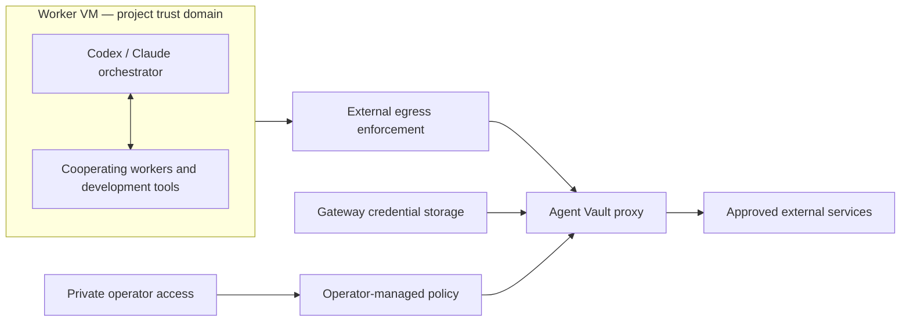

# Agent Gatehouse architecture

Status: initial concept, not a deployed or validated system. Recorded 2026-09-18.

Based on the user-supplied arc42 Template Version 9.0-EN, July 2025, maintained by Dr. Peter Hruschka, Dr. Gernot Starke, and contributors. See [arc42](https://arc42.org). The supplied template's 12 top-level sections are retained below; empty template examples have been replaced with project-specific content.

## 1. Introduction and Goals

### Requirements Overview

Agent Gatehouse provisions a powerful project VM for coding agents and a separate Agent Vault gateway for mediated external access. Agents develop features, investigate bugs, research the web, and query project cloud services. See [requirements](../requirements.md) for the authoritative scope and IDs.

### Quality Goals

| Priority | Goal | Meaning |
| --- | --- | --- |
| 1 | External enforcement | Worker-controlled software cannot bypass egress policy or obtain gateway administration. |
| 2 | Credential separation | Upstream credentials remain outside the worker; permitted operations still work. |
| 3 | Agent usefulness | Preserve normal coding, research, and parallel collaboration. |
| 4 | Simplicity | Reuse Agent Vault; start with one worker VM and one gateway, without per-agent quotas. |
| 5 | Reproducibility | Recreate infrastructure and configuration with IaC and documented secret provisioning. |

### Stakeholders

| Role | Expectations |
| --- | --- |
| Project owner/operator | Choose project authority, administer secrets privately, recreate environments. |
| Developers | Delegate useful work and review resulting changes. |
| Coding agents/orchestrator | Broad local tools, clear permitted services, actionable failures. |
| Infrastructure/security maintainers | Understand trust boundaries, audit decisions, verify controls. |

## 2. Architecture Constraints

- Linux project VM, targeting 64 GB RAM or more and multiple CPU cores.
- One project trust domain; cooperating agents may share data and resources.
- No initial per-agent CPU/RAM quotas or mandatory resource scheduler.
- Agent Vault is the selected gateway basis; its documented preview status and pinned-version behavior require evaluation.
- External network enforcement and gateway administration are outside worker authority, including worker cloud IAM.
- Initial application traffic is HTTP(S). AWS signing and full cloud CLI compatibility are deferred.
- Public repository: no live credentials or sensitive deployment state in source control.
- Cloud provider, IaC tool, exact versions, and management transport are undecided.

## 3. Context and Scope

### Business Context

| External participant | Interaction |
| --- | --- |
| Operator | Provisions infrastructure, grants project capabilities, registers credentials, handles recovery. |
| GitHub/GitLab | Project source, branches, issues, and pull/merge requests. |
| Cloud APIs | Logs, metrics, deployment inspection, and explicitly granted development changes. |
| Public web/search services | Public research; residual outward-data leakage is accepted. |
| Model provider | Approved inference service receiving agent task context. |

Agent Gatehouse does not implement a new coding model, require a custom agent loop, or promise complete data-loss prevention.

### Technical Context

Worker tools send HTTP(S) requests through an explicit proxy. TLS interception enables authentication-header injection for compatible clients. Tools must trust the public gateway CA; its private key stays on the gateway. Client-specific trust/proxy behavior needs testing. Certificate-pinned clients may require dedicated integration; they must not gain unrestricted passthrough as an accidental workaround.

External firewall/routing controls prohibit direct worker egress. DNS, IPv6, metadata endpoints, and operational exceptions form part of that design. A private operator channel provides management without exposing gateway administration to the worker. Exact networking depends on the selected provider.

## 4. Solution Strategy

Use the worker VM as the disposable local blast-radius boundary. Containers organize development tools and workspaces; they are not initially independent security tenants.

Use Agent Vault for credential storage/brokering, service matching, and supported OAuth refresh. Enforce upstream permissions with repository scopes and cloud IAM. Combine these with external egress restrictions so changing worker configuration cannot expand authority.

Prefer Agent Vault configuration over a new proxy implementation. Do not assume its service matcher provides method/body authorization or that its request-rate controls implement byte budgets. Those are potential later extensions.

Retain broad web research and explicitly accept residual leakage risk. No separate research agent is required for v1. See [ADRs 001–005](adr.md).

## 5. Building Block View

### Whitebox Overall System

| Block | Responsibility and interface | Requirements |
| --- | --- | --- |
| Worker VM | Runs agents, tools, containers, workspaces; proxy-only external application access. | F-02–F-05 |
| External network controls | Restrict routes/connections independently of worker root; close direct bypass paths. | S-01, S-02, S-06, S-07 |
| Agent Vault | Authenticate proxy sessions, match service routes, resolve/inject credentials, perform supported OAuth refresh. | F-08, F-11, S-03, S-05 |
| Operator configuration | Define project scope, provision secrets, configure private management and persistence. | F-01, F-12, S-04 |
| IaC/bootstrap | Recreate infrastructure and install/configure the worker and gateway. | F-01, F-13 |

### Level 2: Gateway responsibilities

The agent uses a project-scoped proxy session. Agent Vault resolves service rules and attaches the selected upstream authentication. Secrets and supported OAuth refresh state reside in protected gateway storage. Operator access is distinct from proxy-only agent access.

Agent Vault's documented service matcher uses host, port, and path; it does not inspect method/query/body to authorize an operation. Its unmatched-host policy defaults to forwarding unless configured otherwise. A strict allowlist can use deny-on-unmatched. Broad browsing with explicit blacklisting remains an integration question, not an established built-in capability.

The documented forward-proxy transport can expose proxy authentication in cleartext on the first hop. Select a protected network/tunnel or supported secure frontend arrangement; upstream TLS alone does not solve this. See [Agent Vault security](https://docs.agent-vault.dev/learn/security).

### Level 3

No custom internal components have been designed or implemented yet. Add detail when a concrete integration requires it rather than inventing layers in advance.

## 6. Runtime View

### Provision and bootstrap

1. Operator provisions the network boundary, gateway, and worker using IaC.
2. Operator initializes gateway storage, project rules, and scoped credentials through a private channel.
3. Worker tooling comes from a prepared image or installs through the available gateway.
4. Worker receives proxy configuration, a public CA certificate, and a scoped proxy capability.
5. Boundary tests run before accepting the environment for normal work.

Bootstrap must never temporarily grant unrestricted internet access as an undocumented dependency.

### Authenticated project request

1. Agent constructs a request using ordinary tools and, if useful, a workflow skill.
2. External controls permit access only through the designated gateway path.
3. Gateway authenticates the project session and checks the configured service match.
4. Gateway resolves credentials and injects authentication for that service.
5. Upstream authorization independently enforces repository/cloud scope.
6. Response returns to the worker. Secret-returning endpoints and reflected credentials require prevention or explicit mediation; injection alone is insufficient.

### OAuth refresh

Operator completes a supported OAuth authorization flow. Agent Vault stores tokens and expiry and documents automatic refresh near expiry before injection. A provider refusal, revoked grant, or failed refresh must produce an authentication failure, not a fallback to worker-held credentials. Azure delegated OAuth needs scope/audience validation; other Azure identity flows are not yet established.

### Public research and failures

Public requests pass through the selected browsing policy without project credential injection. URLs and queries may carry private data: this residual risk is accepted. Denied requests should explain the policy reason without revealing secrets. If the gateway is unavailable, external work fails; local coding and tests may continue.

## 7. Deployment View

### Infrastructure Level 1

Initial logical deployment: one project worker VM and one separate gateway host/VM, connected through a private network and externally administered controls. Gateway infrastructure has internet egress; worker infrastructure has no direct internet route/permission.

| Infrastructure | Contents | Authority |
| --- | --- | --- |
| Worker VM | Agent runtimes, Docker/development images, workspaces, proxy client configuration | Broad local project freedom; no infrastructure/gateway administration |
| Gateway host | Agent Vault, protected credential/state storage, public-web/upstream connections | Operator-managed; agent access limited to necessary proxy/session endpoints |
| Network boundary | Firewall/routing and explicit operational exceptions | Operator/IaC only, inaccessible through worker IAM |
| Protected IaC state | Infrastructure metadata and any sensitive state | Operator-controlled, never public Git |

### Infrastructure Level 2

Provider-specific subnets, security groups/firewalls, DNS arrangement, disks, secret provisioning, and private management transport remain open. Select these together so the no-bypass property survives worker root access. Do not assign a broad managed identity or instance role to the worker.

Gateway persistence and backup are required operational concerns; worker recovery may recreate the VM. Define where unfinished work is saved before destructive recovery. There is no initial high-availability commitment or per-agent resource isolation.

## 8. Cross-cutting Concepts

### Identity and capability scope

A proxy session is a capability, not an upstream secret. Scope it to the project, keep its lifetime appropriate, and support revocation. Use the least upstream authority that enables the chosen workflow. Agent Vault proxy roles must not read stored credentials or manage policy.

### Agent freedom and policy ownership

Agents can run code, coordinate, and organize containers. They cannot expand external authority. Repository instructions and skills guide behavior but are not enforcement. Gateway configuration must not be loaded from a worker-writable volume.

### Secrets and observability

Protect secrets in bootstrap, IaC state, gateway backups, debug traces, and API responses as well as environment variables. Record useful request decisions and transfer metadata with redaction. Raw URLs, headers, and bodies can themselves contain sensitive data; avoid indiscriminate capture.

### Resource model

Share the worker's CPU/RAM/disk. Accept local contention and exhaustion. Keep the gateway separate so worker overload does not directly consume gateway resources. No custom resource scheduler is required. Future network-volume heuristics are independent of CPU/RAM quotas.

### Cloud authentication

Agent Vault supports static headers and documented OAuth refresh-token flows. Direct APIs reduce CLI integration work but do not remove authentication requirements. AWS SigV4 is request-dependent signing, not static header injection. Azure token audience and grant type must match the selected API. A skill cannot replace these trusted mechanisms.

## 9. Architecture Decisions

The [ADR document](adr.md) records decisions and consequences:

- ADR-001: Project VM as the local boundary; external enforcement.
- ADR-002: Agent Vault as the initial gateway.
- ADR-003: Shared worker resources without per-agent quotas.
- ADR-004: Broad research with accepted residual leakage risk.
- ADR-005: Direct cloud APIs first; trusted authentication.
- ADR-006: Arc42 architecture plus a separate ADR history.

An accepted ADR records intent, not successful implementation. Supersede records when decisions change.

## 10. Quality Requirements

### Quality Requirements Overview

Prioritize enforceable boundaries, credential separation, useful workflows, and simplicity. Worker availability under overload and complete data confidentiality during broad browsing are explicitly excluded guarantees.

### Quality Scenarios

| Scenario | Expected response | Acceptance evidence |
| --- | --- | --- |
| Worker removes proxy configuration and attempts direct egress | External controls reject the connection | A-02 |
| Agent calls a permitted authenticated API | Request succeeds without upstream secret exposure | A-04 |
| Agent changes destination/path or follows a redirect | No out-of-scope credential injection | A-05 |
| Worker probes control/metadata endpoints | Access rejected | A-06 |
| Gateway stops | Outbound access fails closed | A-07 |
| Agents work concurrently | Shared resources usable without added per-agent quotas | A-08 |
| OAuth token nears expiry | Gateway refreshes or returns authentication failure | A-09 |
| Agent investigates a cloud issue | Scoped log queries work; other scopes are denied | A-10 |

No measurements or test results exist yet. See [requirements](../requirements.md) for the complete milestone criteria.

## 11. Risks and Technical Debts

| Risk/open item | Treatment |
| --- | --- |
| Agent Vault preview and version drift | Pin a version and verify capabilities; do not treat this research as an audit. |
| Broad browsing plus private context enables leakage | Accepted; optional later heuristics reduce but cannot eliminate it. |
| Blacklist/browsing policy mismatch | Verify actual support before promising a denylist; add a component only if needed. |
| Worker root reaches infrastructure control APIs | Scope IAM and enforce externally; include adversarial tests. |
| Allowed API returns secrets or allows harmful changes | Restrict upstream authority and sensitive operations; test response exposure. |
| Proxy session interception or replay | Protect first-hop transport, scope sessions, and revoke them. |
| Tool incompatibility with proxy/CA | Test actual tools; do not open unrestricted bypasses. |
| Gateway compromise | Gateway is trusted and holds secrets; minimize exposure and protect management/state. |
| Worker resource exhaustion/data loss | Accepted interruption risk; define artifact persistence and recovery. |
| Cloud identity/signing integration gaps | Validate Azure flow; defer AWS signing unless brought into scope. |
| Provider-hosted tools bypass local inspection | Explicitly decide which remote capabilities are allowed. |

### Primary references

Reviewed in the concept discussion on 2026-09-18; compatibility has not been tested:

- [Agent Vault project and preview status](https://github.com/Infisical/agent-vault)
- [Service matching and authentication](https://docs.agent-vault.dev/learn/services)
- [OAuth credential refresh](https://docs.agent-vault.dev/learn/credentials)
- [Security, roles, network guards, and transport](https://docs.agent-vault.dev/learn/security)

## 12. Glossary

| Term | Definition |
| --- | --- |
| Worker VM | Resource-rich, disposable machine where project agents and tools run. |
| Gateway | External Agent Vault deployment mediating HTTP(S) access and injecting credentials. |
| Capability | Granted authority to perform a defined class of external operations. |
| Upstream credential | Authentication material accepted by the destination service. |
| Proxy session | Scoped authority to use the gateway, without permission to reveal upstream credentials. |
| External enforcement | Controls the worker cannot change, even with local root. |
| OAuth refresh | Exchanging a refresh token for a new access token without exposing either to the worker. |
| SigV4 | AWS request-signing mechanism computed over request-specific information. |
| ADR | Architecture Decision Record: context, decision, alternatives, and consequences. |
