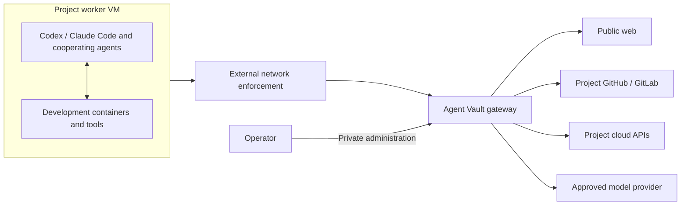

# Agent Gatehouse

Autonomous agents. Controlled access.

Agent Gatehouse gives Codex and Claude Code broad freedom to develop software inside a project VM. A separate gateway based on [Infisical Agent Vault](https://github.com/Infisical/agent-vault) controls external access and supplies authentication without giving upstream credentials to the agents.

The guiding decision is:

> Give agents broad freedom within their workspaces, but make every outward authority a capability enforced by infrastructure they cannot modify.

## Status

This repository currently contains requirements and an architectural concept. It does not yet contain a working deployment. Cloud provider, infrastructure-as-code tooling, and several gateway integration details remain open.

## What it is for

A project has GitHub or GitLab repositories and a cloud environment. Agents investigate issues, search the web, query cloud logs, implement features, run tests, and prepare changes. An orchestrator can itself be Codex or Claude Code and delegate to cooperating agents on the same VM.

Agents share the project's trust boundary and the VM's resources. Development containers provide convenient tool environments; the outer VM and external network controls define the initial security boundary.

## Initial scope

- Infrastructure as code for a project worker VM, a separate gateway, and external network enforcement.
- A resource-rich Linux worker VM, targeting 64 GB RAM or more and multiple CPU cores, without per-agent CPU/RAM quotas.
- Worker configuration for the proxy, its public CA certificate, coding agents, Git, Docker, and common development tools.
- Agent Vault configuration for project-scoped access and upstream credential injection.
- Validation that useful development works while direct internet access fails.

The worker has internet access only through the gateway. Changing proxy variables, container settings, or the worker's own firewall must not allow a direct connection. Gateway secrets, administration, and network policy are outside the agents' authority.

## Security expectations

Agent Gatehouse aims to keep upstream authentication credentials outside the worker and constrain external access to the configured project authority. It does **not** promise that broad web access cannot leak private data. That residual risk is accepted; transfer limits and content heuristics are potential later mitigations.

Model providers are approved recipients of the context needed for inference. A compromised worker may misuse any authority deliberately granted to it. The VM limits local damage, but project cloud permissions and repository credentials determine the external blast radius.

Agent Vault documents automatic OAuth refresh for refresh-token-based flows. Azure delegated OAuth is a candidate to validate; this does not establish support for all Azure identity flows. AWS request signing remains a separate integration. Agent Vault is currently documented as a preview, so feature compatibility and security properties require verification against a pinned version.

## Documentation

| Document | Purpose |
| --- | --- |
| [Requirements](requirements.md) | Agreed scope, requirements, exclusions, and acceptance criteria |
| [Architecture](docs/architecture.md) | Living architecture using the supplied arc42 structure |
| [Architecture decision records](docs/adr.md) | Why significant decisions were made and their consequences |
| [Agent instructions](AGENTS.md) | How coding agents should work in this repository |

There are no installation commands yet. The first implementation milestone is a reproducible deployment where an agent can browse, develop, and use an authenticated project service while upstream credentials remain outside the worker and direct egress is blocked.

## License

Agent Gatehouse's original code and documentation are licensed under the [MIT License](LICENSE) (also known as MIT Expat; SPDX: `MIT`). Third-party components and incorporated material retain their respective licenses and notices.
